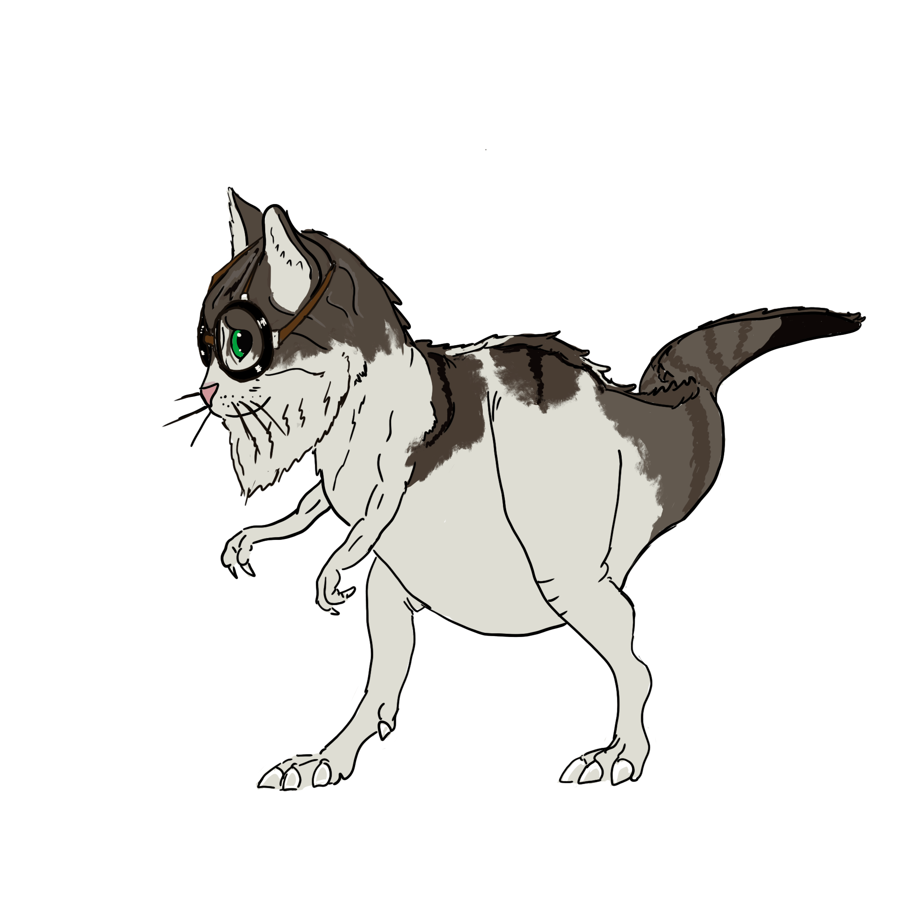
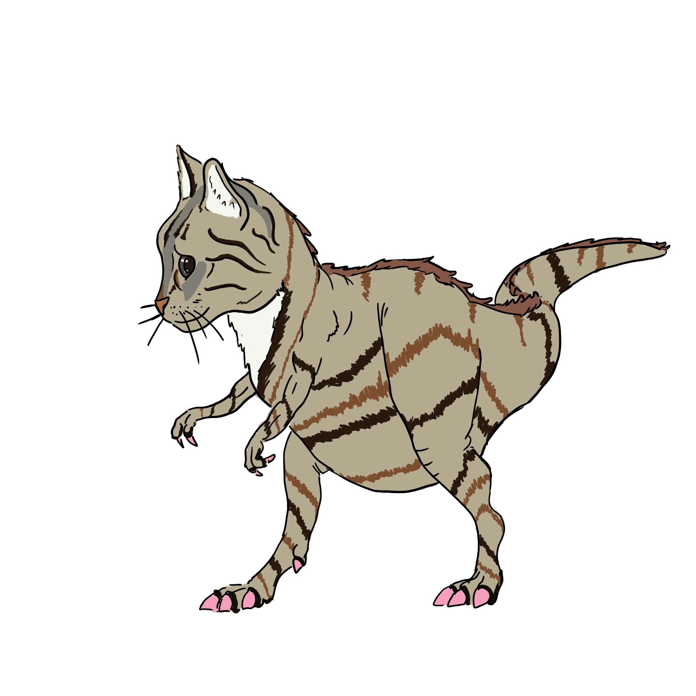
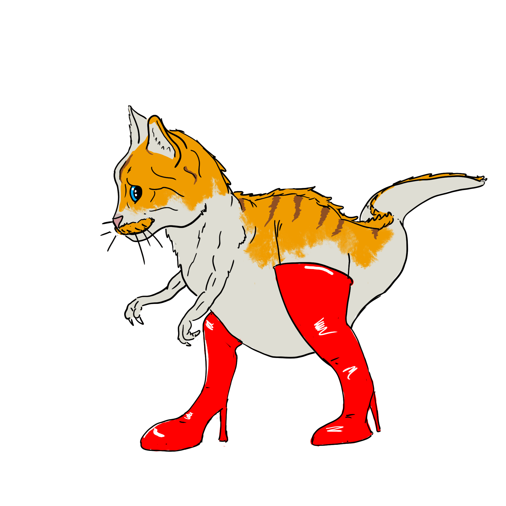
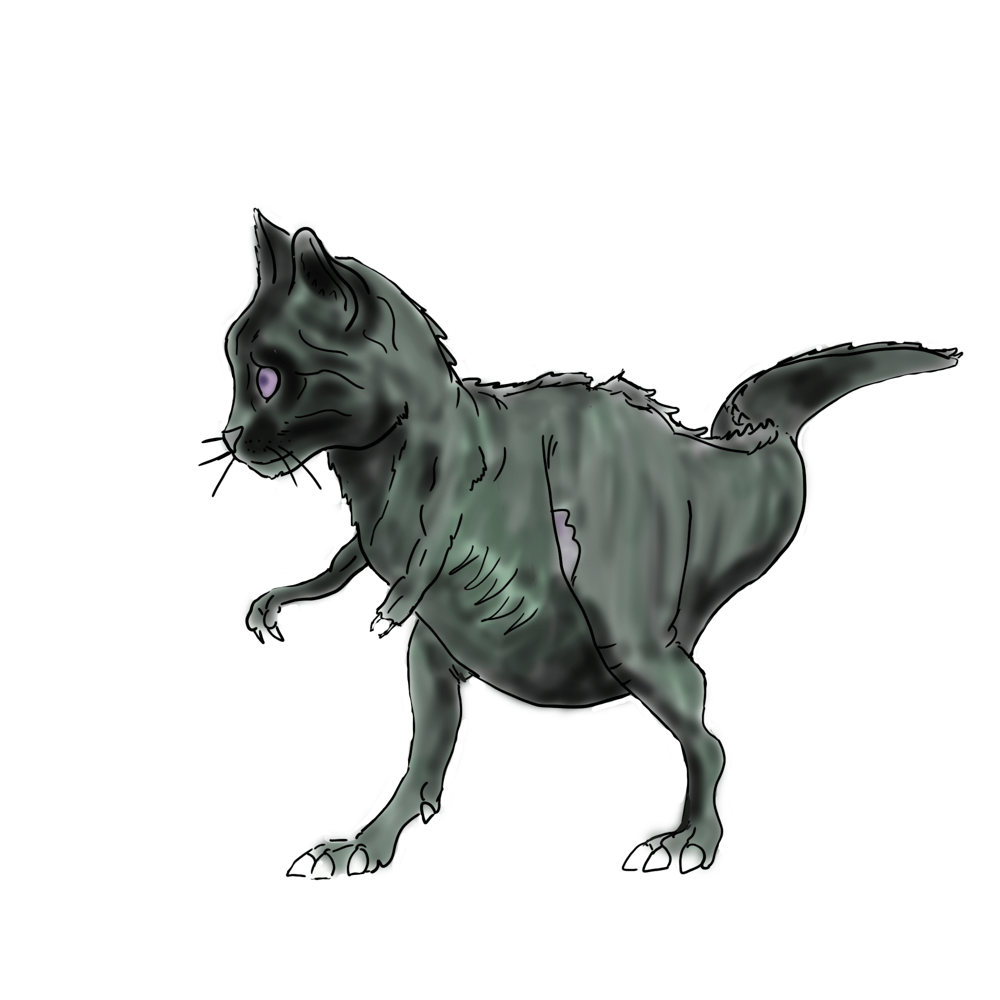

# TEST MY ELEPHANT

## Teamosaurus Fantasticus :

| Alix Boufflers | Claire Magisson-Bonnel | Gaël Bertrand | Thibaut Gerin |
|:--------------:|:----------------------:|:-------------:|:-------------:|
||  |  |  |

## Projet :

:fr: Dans le cadre de notre formation DFS au sein de l'It-Akademy, 
il nous a été demandé de créer une application permettant à un utilisateur 
de tester son code en PHP à la recherche de failles de sécurité.

---

:gb: During our Development course, we were asked to create an application 
that allows to test PHP code looking for security vulnerabilities
 

## Genesis :

:fr: Avant de commencer à coder, nous avons établi un **cahier des charges** nous permettant de lister :
 * Les fonctionnalités nécessaires
 * Les langages et frameworks que nous souhaitions utiliser
 * Les conventions que nous souhaitions respecter au sein de l'équipe
 * Les librairies existantes permettant de faire de l'analyse statique de code PHP
 * Le niveau de priorité de chaque fonctionnalité

:fr: Nous avons aussi défini une **organisation** de groupe :
* Utilisation du Board fourni par GitHub
* Petites réunions en début, milieu et fin de journée afin de maximiser notre synchronisation
 

---

:gb: Before starting coding, we wrote **specifications** in order to list :
 * Necessary features
 * Langages and Frameworks we wanted to use
 * Conventions we wanted to work with
 * Existing libraries allowing to make static analysis of PHP code
 * Priority level of each feature
 

:uk: We also defined a group **organisation** :
* Using of GitHub board
* Short meetings on mornings, evening and before lunch to maximise group synchronisation
 

## Development : 
:fr: 
* Utilisation de
    * Framework [LARAVEL](https://laravel.com/) (Taylor Otwell Forever :heart: )
    * [Gitmojis](https://gitmoji.dev/) pour indiquer le sujet de nos commits
    * [ProgPilot](https://github.com/designsecurity/progpilot) pour rechercher des failles de sécurités
     

 * Développement systématiquement en **pair-programming** (ce qui explique que le nombre de push et de Pull-Request ne 
   soit pas identique pour chaque membre du groupe)
   

 * La méthode **[Pomodoro](https://fr.wikipedia.org/wiki/Technique_Pomodoro)** 
   grâce à [Pomofocus](https://pomofocus.io/)
   
---

:uk:
* Use of
    * Framework [LARAVEL](https://laravel.com/) (Taylor Otwell Forever :heart: )
    * [Gitmojis](https://gitmoji.dev/) to write our commits' messages
    * [ProgPilot](https://github.com/designsecurity/progpilot) to scan repositories looking for security vulnerabilities

* Systematic **pair-programming** development

*  **[Pomodoro](https://fr.wikipedia.org/wiki/Technique_Pomodoro) method**
  thanks to [Pomofocus](https://pomofocus.io/)

